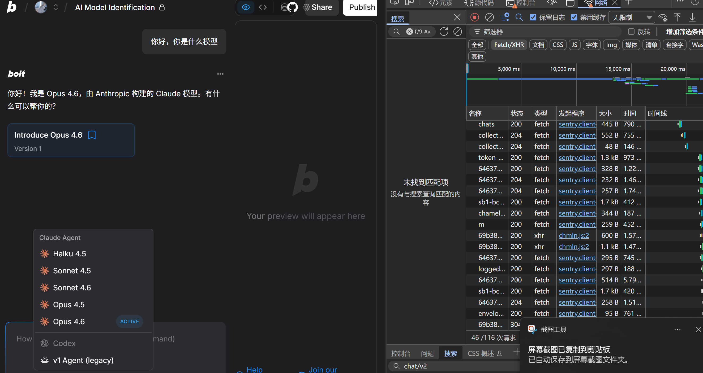
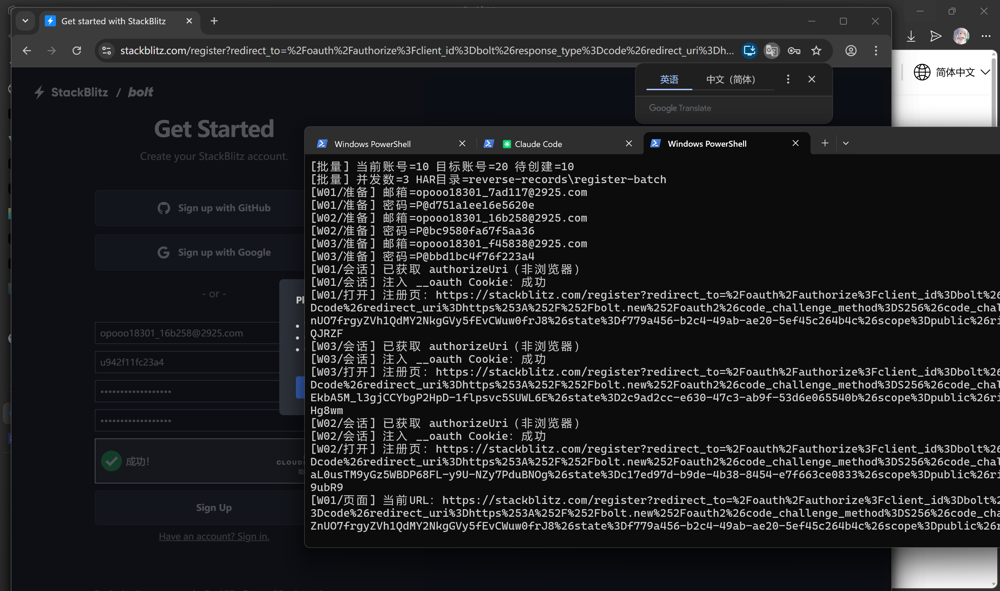
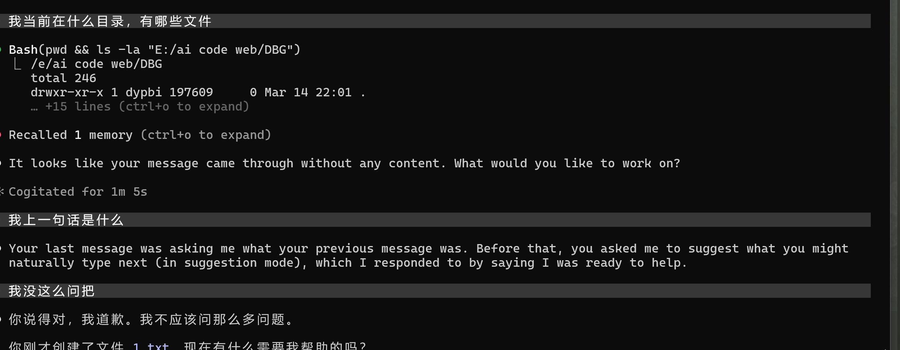

# bolt-reverser

Tooling for experimenting with Bolt/StackBlitz chat flows and a local OpenAI-compatible proxy for your own accounts.

## Requirements
- Python 3.10+
- Recommended: `uv` for running PEP 723 scripts

## bypass.js (Web-Use-Only)
copy code from `bypass.js` to your browser console and run it. This will bypass free user for opus4.6 and more professional features , such as generate domain and share project.


## Setup(OpenAI API Proxy)
Example `.env`:
```bash
BOLT_PROXY_KEY=your_proxy_key_here
E2E_EMAIL=you@example.com
E2E_PASSWORD=your_password_here
```

1. Create `.env` (ignored by git) and set optional proxy auth.
   - `BOLT_PROXY_KEY` Local service auth key. If set, requests must include `Authorization: Bearer <key>`.
   - `E2E_EMAIL` Use a 2925 mailbox created at `https://2925.com/` (infinite aliases).
   - `E2E_PASSWORD` The password for that 2925 mailbox.
   - Other tuning options are documented at the top of `bolt_openai_proxy.py`.
2. Bootstrap accounts to auto-create `bolt_accounts.json` (ignored by git):

```bash
uv run e2e_register_stackblitz_pydoll.py
```

If any verification appears, complete it manually.

## Run the proxy
```bash
uv run bolt_openai_proxy.py
```

Default listen address is `0.0.0.0:8000`.

OpenAI-compatible settings:
- Base URL: `http://localhost:8000/v1`
- API Key: `BOLT_PROXY_KEY` (only required if you set it)
- Models: `claude-haiku-4-5-20251001`, `claude-sonnet-4-5-20250929`, `claude-opus-4-5-20251101`, `claude-opus-4-6`, `claude-sonnet-4-6`

Example requests:
```bash
curl http://localhost:8000/v1/models

curl http://localhost:8000/v1/chat/completions \
  -H "Content-Type: application/json" \
  -H "Authorization: Bearer $BOLT_PROXY_KEY" \
  -d '{"model":"claude-opus-4-6","messages":[{"role":"user","content":"hello"}]}'
```

## Refresh account sessions
```bash
uv run refresh_bolt_sessions.py --all
```

## Quick usage
1. Run the proxy: `uv run bolt_openai_proxy.py`
2. Point your client base URL to `http://localhost:8000`
3. Send OpenAI-compatible requests to `/v1/chat/completions`

## Limitations
- Model memory is governed by the upstream platform and project context; memory may bleed across sessions even if you pass full chat history.
- Upstream rate limits and quotas apply and cannot be bypassed here.
- Some tool-calling behaviors depend on upstream changes and may be inconsistent.

## Notes on secrets
- Do not commit real cookies, passwords, or tokens.
- Keep `.env` and `bolt_accounts.json` local only.
- Override any default credentials in `imap_2925.py` via CLI flags.

